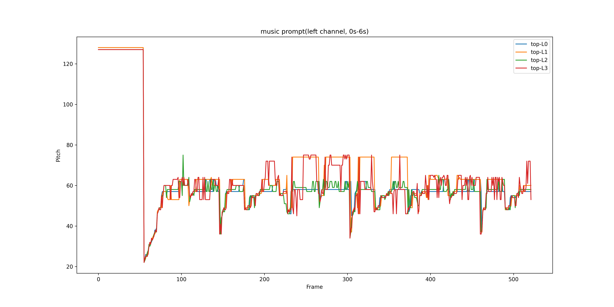
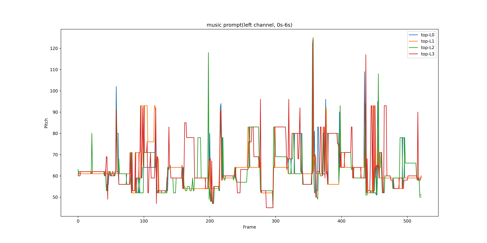

 

<h1> Editing Music with Melody and Text:   Using ControlNet for Diffusion Transformer </h1>
Siyuan Hou, Shansong Liu, Ruibin Yuan, Wei Xue, Ying Shan, Mangsuo Zhao, Chao Zhang    
Supporting webpage for ICASSP 2025.
<!-- Code is available <a href="https://github.com/NilsDem/control-transfer-diffusion/">here</a> -->

 

<h3>Abstract</h3>

Despite the significant progress in controllable music generation and editing, challenges remain in the quality and length of generated music due to the use of Mel-spectrogram representations and UNet-based model structures. To address these limitations, we propose a novel approach using a Diffusion Transformer (DiT) augmented with an additional control branch using ControlNet. This allows for long-form and variable-length music generation and editing controlled by text and melody prompts.
For more precise and fine-grained melody control, we introduce a novel top-k constant-Q Transform representation as the melody prompt, reducing ambiguity compared to previous representations (e.g., chroma), particularly for music with multiple tracks or a wide range of pitch values. To effectively balance the control signals from text and melody prompts, we adopt a curriculum learning strategy that progressively masks the melody prompt, resulting in a more stable training process.
Experiments have been performed on text-to-music generation and music-style transfer tasks using open-source instrumental recording data. The results demonstrate that by extending StableAudio, a pre-trained text-controlled DiT model, our approach enables superior melody-controlled editing while retaining good text-to-music generation performance. These results outperform a strong MusicGen baseline in terms of both text-based generation and melody preservation for editing.

# Music Editing

Examples in text-to-music generation on the [Song Describer dataset](https://github.com/mulab-mir/song-describer-dataset). 
For our model, we use a text prompt from dataset and a music prompt extracted from the target audio as conditions to complete the text-to-music task.  For the baseline [MusicGEN](https://github.com/facebookresearch/audiocraft/blob/main/docs/MUSICGEN.md), the same text prompt and its melody condition in the form of chroma are used.

Scroll to see all the results if necessary.

<table class="table table-sm text-center" style="vertical-align: middle;">
  <colgroup>
      <col style="width: 300px;">
      <col style="width: 600px;">
      <col style="width: 200px;">
      <col style="width: 200px;">
      <col style="width: 200px;">
  </colgroup>
  <thead>
    <tr>
      <th style="text-align:center;">text prompt</th>
      <th style="text-align:center;">music prompt</th>
      <th style="text-align:center;">Target</th>
      <th style="text-align:center;">MusicGen-melody</th>
      <th style="text-align:center;">MusicGen-melody-large</th>
      <th style="text-align:center;">Ours</th>
    </tr>
  </thead>
  <tbody>
    <tr>
      <td>A twisty nice melody song by a slide electric guitar on top of acoustic chords later accompanied with a ukelele.</td>
      <td></img></td>
      <td><audio src="../audios/transfer/target/95.wav" controls style="width: 200px"></audio></td>
      <td><audio src="../audios/transfer/melody/95.wav" controls style="width: 200px"></audio></td>
      <td><audio src="../audios/transfer/melody-large/95.wav" controls style="width: 200px"></audio></td>
      <td><audio src="../audios/transfer/our/95.wav" controls style="width: 200px"></audio></td>
    </tr>
    <tr>
      <td>8-bit melody brings one back to the arcade saloons while keeping the desire to dance.</td>
      <td></img></td>
      <td><audio src="../audios/transfer/target/99.wav" controls style="width: 200px"></audio></td>
      <td><audio src="../audios/transfer/melody/99.wav" controls style="width: 200px"></audio></td>
      <td><audio src="../audios/transfer/melody-large/99.wav" controls style="width: 200px"></audio></td>
      <td><audio src="../audios/transfer/our/99.wav" controls style="width: 200px"></audio></td>
    </tr>
    <tr>
      <td>Instrumental piano piece with a slightly classical touch and a nostalgic, bittersweet or blue mood.</td>
      <td></img></td>
      <td><audio src="../audios/transfer/target/327.wav" controls style="width: 200px"></audio></td>
      <td><audio src="../audios/transfer/melody/327.wav" controls style="width: 200px"></audio></td>
      <td><audio src="../audios/transfer/melody-large/327.wav" controls style="width: 200px"></audio></td>
      <td><audio src="../audios/transfer/our/327.wav" controls style="width: 200px"></audio></td>
    </tr>
    <tr>
      <td>Positive instrumental pop song with a strong rhythm and brass section.</td>
      <td></img></td>
      <td><audio src="../audios/transfer/target/343.wav" controls style="width: 200px"></audio></td>
      <td><audio src="../audios/transfer/melody/343.wav" controls style="width: 200px"></audio></td>
      <td><audio src="../audios/transfer/melody-large/343.wav" controls style="width: 200px"></audio></td>
      <td><audio src="../audios/transfer/our/343.wav" controls style="width: 200px"></audio></td>
    </tr>
    <tr>
      <td>A blues piano track that would be very well suited in a 90s sitcom. The piano occupies the whole track that has a prominent bass line as well, with a general jolly and happy feeling throughout the song.</td>
      <td></img></td>
      <td><audio src="../audios/transfer/target/567.wav" controls style="width: 200px"></audio></td>
      <td><audio src="../audios/transfer/melody/567.wav" controls style="width: 200px"></audio></td>
      <td><audio src="../audios/transfer/melody-large/567.wav" controls style="width: 200px"></audio></td>
      <td><audio src="../audios/transfer/our/567.wav" controls style="width: 200px"></audio></td>
    </tr>
    <tr>
      <td>An upbeat pop instrumental track starting with synthesized piano sound, later with guitar added in, and then a saxophone-like melody line.</td>
      <td></img></td>
      <td><audio src="../audios/transfer/target/835.wav" controls style="width: 200px"></audio></td>
      <td><audio src="../audios/transfer/melody/835.wav" controls style="width: 200px"></audio></td>
      <td><audio src="../audios/transfer/melody-large/835.wav" controls style="width: 200px"></audio></td>
      <td><audio src="../audios/transfer/our/835.wav" controls style="width: 200px"></audio></td>
    </tr>
    <tr>
      <td>Pop song with a classical chord progression in which all instruments join progressively, building up a richer and richer music.</td>
      <td></img></td>
      <td><audio src="../audios/transfer/target/903.wav" controls style="width: 200px"></audio></td>
      <td><audio src="../audios/transfer/melody/903.wav" controls style="width: 200px"></audio></td>
      <td><audio src="../audios/transfer/melody-large/903.wav" controls style="width: 200px"></audio></td>
      <td><audio src="../audios/transfer/our/903.wav" controls style="width: 200px"></audio></td>
    </tr>
    <tr>
      <td>An instrumental world fusion track with prominent reggae elements.</td>
      <td></img></td>
      <td><audio src="../audios/transfer/target/959.wav" controls style="width: 200px"></audio></td>
      <td><audio src="../audios/transfer/melody/959.wav" controls style="width: 200px"></audio></td>
      <td><audio src="../audios/transfer/melody-large/959.wav" controls style="width: 200px"></audio></td>
      <td><audio src="../audios/transfer/our/959.wav" controls style="width: 200px"></audio></td>
    </tr>
  </tbody>
</table> 

# Timbre Transfer
## Synthetic Data

Examples in timbre transfer on the [Slakh dataset](http://www.slakh.com/). We compare our method with two baselines, Music Style Transfer <a href="#note2" id="note1ref">[2]</a> and SS-VAE <a href="#note1" id="note3ref">[3]</a>.

|    | Source | Target | SS-VAE | Music Style Transfer | Ours no adv. | Ours |
| :-:| :-: | :-:  |:-:  | :-: | :-: | :-: |
| Piano to guitar |<audio src="audios/slakh/true/piano_guitar_1.wav" controls style="width:  200px"></audio> | <audio src="audios/slakh/target/piano_guitar_1.wav" controls style="width:  200px"></audio> | <audio src="audios/slakh/ssvae/piano_guitar_1.wav" controls style="width:  200px"></audio> | <audio src="audios/slakh/mst/piano_guitar_1.wav" controls style="width:  200px"></audio> | <audio src="audios/slakh/ours_bottleneck/piano_guitar_1.wav" controls style="width:  200px"></audio> | <audio src="audios/slakh/ours/piano_guitar_1.wav" controls style="width:  200px"></audio> |
| guitar to voice |<audio src="audios/slakh/true/guitar_voice.wav" controls style="width:  200px"></audio> | <audio src="audios/slakh/target/guitar_voice.wav" controls style="width:  200px"></audio> | <audio src="audios/slakh/ssvae/guitar_voice.wav" controls style="width:  200px"></audio> | <audio src="audios/slakh/mst/guitar_voice.wav" controls style="width:  200px"></audio> | <audio src="audios/slakh/ours_bottleneck/guitar_voice.wav" controls style="width:  200px"></audio> | <audio src="audios/slakh/ours/guitar_voice.wav" controls style="width:  200px"></audio> |
| synth to strings |<audio src="audios/slakh/true/synth_strings.wav" controls style="width:  200px"></audio> | <audio src="audios/slakh/target/synth_strings.wav" controls style="width:  200px"></audio> | <audio src="audios/slakh/ssvae/synth_strings.wav" controls style="width:  200px"></audio> | <audio src="audios/slakh/mst/synth_strings.wav" controls style="width:  200px"></audio> | <audio src="audios/slakh/ours_bottleneck/synth_strings.wav" controls style="width:  200px"></audio> | <audio src="audios/slakh/ours/synth_strings.wav" controls style="width:  200px"></audio> |
| guitar to flute |<audio src="audios/slakh/true/guitar_flute_2.wav" controls style="width:  200px"></audio> | <audio src="audios/slakh/target/guitar_flute_2.wav" controls style="width:  200px"></audio> | <audio src="audios/slakh/ssvae/guitar_flute_2.wav" controls style="width:  200px"></audio> | <audio src="audios/slakh/mst/guitar_flute_2.wav" controls style="width:  200px"></audio> | <audio src="audios/slakh/ours_bottleneck/guitar_flute_2.wav" controls style="width:  200px"></audio> | <audio src="audios/slakh/ours/guitar_flute_2.wav" controls style="width:  200px"></audio> |
| bass to keys |<audio src="audios/slakh/true/bass_keys.wav" controls style="width:  200px"></audio> | <audio src="audios/slakh/target/bass_keys.wav" controls style="width:  200px"></audio> | <audio src="audios/slakh/ssvae/bass_keys.wav" controls style="width:  200px"></audio> | <audio src="audios/slakh/mst/bass_keys.wav" controls style="width:  200px"></audio> | <audio src="audios/slakh/ours_bottleneck/bass_keys.wav" controls style="width:  200px"></audio> | <audio src="audios/slakh/ours/bass_keys.wav" controls style="width:  200px"></audio> |
| guitar to guitar |<audio src="audios/slakh/true/guitar_disto.wav" controls style="width:  200px"></audio> | <audio src="audios/slakh/target/guitar_disto.wav" controls style="width:  200px"></audio> | <audio src="audios/slakh/ssvae/guitar_disto.wav" controls style="width:  200px"></audio> | <audio src="audios/slakh/mst/guitar_disto.wav" controls style="width:  200px"></audio> | <audio src="audios/slakh/ours_bottleneck/guitar_disto.wav" controls style="width:  200px"></audio> | <audio src="audios/slakh/ours/guitar_disto.wav" controls style="width:  200px"></audio> |

## Real Data

Examples in timbre transfer on three real instrumental recordings datasets.

|   | Source | Target | SS-VAE | Music Style Transfer | Ours no adv. | Ours |
| :-:| :-: | :-:  |:-:  | :-: | :-: | :-: |
| piano to guitar |<audio src="audios/real/true/piano_guitar_2.wav" controls style="width:  200px"></audio> | <audio src="audios/real/target/piano_guitar_2.wav" controls style="width:  200px"></audio> | <audio src="audios/real/ssvae/piano_guitar_2.wav" controls style="width:  200px"></audio> | <audio src="audios/real/mst/piano_guitar_2.wav" controls style="width:  200px"></audio> | <audio src="audios/real/bottleneck/piano_guitar_2.wav" controls style="width:  200px"></audio> | <audio src="audios/real/ours/piano_guitar_2.wav" controls style="width:  200px"></audio> |
| guitar to piano |<audio src="audios/real/true/guitar_piano_3.wav" controls style="width:  200px"></audio> | <audio src="audios/real/target/guitar_piano_3.wav" controls style="width:  200px"></audio> | <audio src="audios/real/ssvae/guitar_piano_3.wav" controls style="width:  200px"></audio> | <audio src="audios/real/mst/guitar_piano_3.wav" controls style="width:  200px"></audio> | <audio src="audios/real/bottleneck/guitar_piano_3.wav" controls style="width:  200px"></audio> | <audio src="audios/real/ours/guitar_piano_3.wav" controls style="width:  200px"></audio> |
| flute to piano |<audio src="audios/real/true/flute_piano.wav" controls style="width:  200px"></audio> | <audio src="audios/real/target/flute_piano.wav" controls style="width:  200px"></audio> | <audio src="audios/real/ssvae/flute_piano.wav" controls style="width:  200px"></audio> | <audio src="audios/real/mst/flute_piano.wav" controls style="width:  200px"></audio> | <audio src="audios/real/bottleneck/flute_piano.wav" controls style="width:  200px"></audio> | <audio src="audios/real/ours/flute_piano.wav" controls style="width:  200px"></audio> |
| guitar to flute |<audio src="audios/real/true/guitar_flute_3.wav" controls style="width:  200px"></audio> | <audio src="audios/real/target/guitar_flute_3.wav" controls style="width:  200px"></audio> | <audio src="audios/real/ssvae/guitar_flute_3.wav" controls style="width:  200px"></audio> | <audio src="audios/real/mst/guitar_flute_3.wav" controls style="width:  200px"></audio> | <audio src="audios/real/bottleneck/guitar_flute_3.wav" controls style="width:  200px"></audio> | <audio src="audios/real/ours/guitar_flute_3.wav" controls style="width:  200px"></audio> |
| piano to flute |<audio src="audios/real/true/piano_flute.wav" controls style="width:  200px"></audio> | <audio src="audios/real/target/piano_flute.wav" controls style="width:  200px"></audio> | <audio src="audios/real/ssvae/piano_flute.wav" controls style="width:  200px"></audio> | <audio src="audios/real/mst/piano_flute.wav" controls style="width:  200px"></audio> | <audio src="audios/real/bottleneck/piano_flute.wav" controls style="width:  200px"></audio> | <audio src="audios/real/ours/piano_flute.wav" controls style="width:  200px"></audio> |
| violin to guitar |<audio src="audios/real/true/violin_guitar.wav" controls style="width:  200px"></audio> | <audio src="audios/real/target/violin_guitar.wav" controls style="width:  200px"></audio> | <audio src="audios/real/ssvae/violin_guitar.wav" controls style="width:  200px"></audio> | <audio src="audios/real/mst/violin_guitar.wav" controls style="width:  200px"></audio> | <audio src="audios/real/bottleneck/violin_guitar.wav" controls style="width:  200px"></audio> | <audio src="audios/real/ours/violin_guitar.wav" controls style="width:  200px"></audio> |
| violin to piano |<audio src="audios/real/true/violin_piano.wav" controls style="width:  200px"></audio> | <audio src="audios/real/target/violin_piano.wav" controls style="width:  200px"></audio> | <audio src="audios/real/ssvae/violin_piano.wav" controls style="width:  200px"></audio> | <audio src="audios/real/mst/violin_piano.wav" controls style="width:  200px"></audio> | <audio src="audios/real/bottleneck/violin_piano.wav" controls style="width:  200px"></audio> | <audio src="audios/real/ours/violin_piano.wav" controls style="width:  200px"></audio> |
| piano to piano |<audio src="audios/real/true/piano_pianoreverb.wav" controls style="width:  200px"></audio> | <audio src="audios/real/target/piano_pianoreverb.wav" controls style="width:  200px"></audio> | <audio src="audios/real/ssvae/piano_pianoreverb.wav" controls style="width:  200px"></audio> | <audio src="audios/real/mst/piano_pianoreverb.wav" controls style="width:  200px"></audio> | <audio src="audios/real/bottleneck/piano_pianoreverb.wav" controls style="width:  200px"></audio> | <audio src="audios/real/ours/piano_pianoreverb.wav" controls style="width:  200px"></audio> |

# Music style transfer

Examples in musical style transfer between recordings of rock, jazz, dub and lofi hip-hop. For music gen, we use the source audio as melody input and the following prompts : 
- Jazz : 'In the style of a jazz song'
- Rock : 'In the style of instrumental rock'
- Dub : 'In the style of dub reggae music'
- Lofi : 'In the style of lofi hip hop'

| Source | Target | MusicGen | Ours no adv. | Ours |
| :-: | :-:  |:-:  | :-: | :-: |
|<audio src="audios/music/true/dub0.wav" controls style="width:  200px"></audio> | <audio src="audios/music/true/dub0_jazz.wav" controls style="width:  200px"></audio> |  <audio src="audios/music/musicgen/dub0.wav" controls style="width:  200px"></audio> | <audio src="audios/music/bottleneck/dub0.wav"  controls style="width:  200px"></audio> | <audio src="audios/music/true/dub0_jazz_out.wav" controls style="width:  200px"></audio> | 
|<audio src="audios/music/true/dub1.wav" controls style="width:  200px"></audio> | <audio src="audios/music/true/dub1_jazz1.wav" controls style="width:  200px"></audio> |  <audio src="audios/music/musicgen/dub1.wav" controls style="width:  200px"></audio> | <audio src="audios/music/bottleneck/dub1.wav"  controls style="width:  200px"></audio> | <audio src="audios/music/true/dub1_jazz1_out.wav" controls style="width:  200px"></audio> | 
|<audio src="audios/music/true/dub2.wav" controls style="width:  200px"></audio> | <audio src="audios/music/true/dub2_rock.wav" controls style="width:  200px"></audio> |  <audio src="audios/music/musicgen/dub2.wav" controls style="width:  200px"></audio> | <audio src="audios/music/bottleneck/dub2.wav"  controls style="width:  200px"></audio> | <audio src="audios/music/true/dub2_rock_out.wav" controls style="width:  200px"></audio> | 
|<audio src="audios/music/true/jazz.wav" controls style="width:  200px"></audio> | <audio src="audios/music/true/jazz_rock.wav" controls style="width:  200px"></audio> |  <audio src="audios/music/musicgen/jazz.wav" controls style="width:  200px"></audio> | <audio src="audios/music/bottleneck/jazz.wav"  controls style="width:  200px"></audio> | <audio src="audios/music/true/jazz_rock_out.wav" controls style="width:  200px"></audio> |
|<audio src="audios/music/true/jazz2.wav" controls style="width:  200px"></audio> | <audio src="audios/music/true/jazz2_lofi.wav" controls style="width:  200px"></audio> |  <audio src="audios/music/musicgen/jazz2.wav" controls style="width:  200px"></audio> | <audio src="audios/music/bottleneck/jazz2.wav"  controls style="width:  200px"></audio> | <audio src="audios/music/true/jazz2_lofi_out.wav" controls style="width:  200px"></audio> | 
|<audio src="audios/music/true/rock1.wav" controls style="width:  200px"></audio> | <audio src="audios/music/true/rock1_dub.wav" controls style="width:  200px"></audio> |  <audio src="audios/music/musicgen/rock1.wav" controls style="width:  200px"></audio> | <audio src="audios/music/bottleneck/rock1.wav"  controls style="width:  200px"></audio> | <audio src="audios/music/true/rock1_dub_out.wav" controls style="width:  200px"></audio> | 

## References 

<a id="note1" href="#note1ref">[1]</a> C. Hawthorne, I. Simon, A. Roberts, N. Zeghidour, J. Gardner, E. Manilow, and J. Engel, “Multi-instrument music synthesis with spectrogram diffusion,” arXiv preprint arXiv:2206.05408, 2022.615

<a id="note2" href="#note2ref">[2]</a> O. Cífka, A. Ozerov, U.  ̧Sim ̧sekli, and G. Richard “Self-supervised vq-vae for one-shot music style transfer,” in ICASSP 2021-2021 IEEE International Conference on Acoustics, Speech and Signal Processin(ICASSP). IEEE, 2021, pp. 96–100

<a id="note3" href="#note3ref">[3]</a>  Li, Y. Zhang, F. Tang, C. Ma, W. Dong, and C. Xu, “Music style transfer with time-varying inversion of diffusion models,” in Proceedings of the AAAI Conference on Artificial Intelligence, vol. 38, no. 1, 2024, pp.547–555
