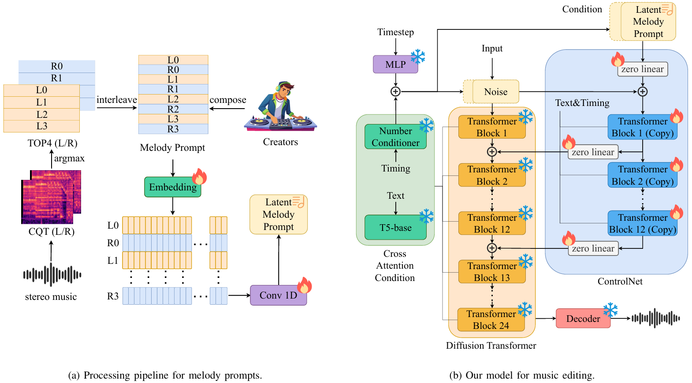
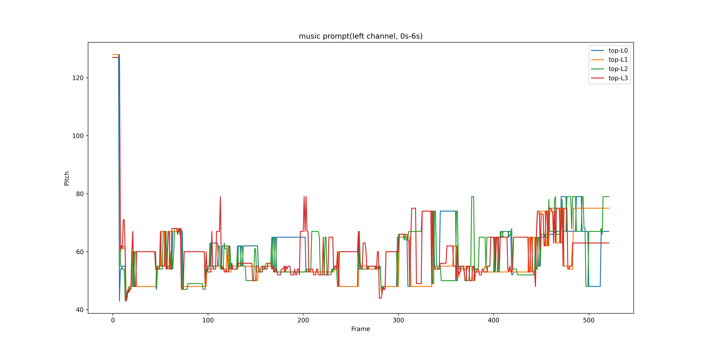
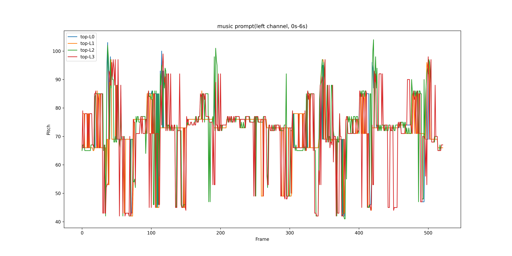
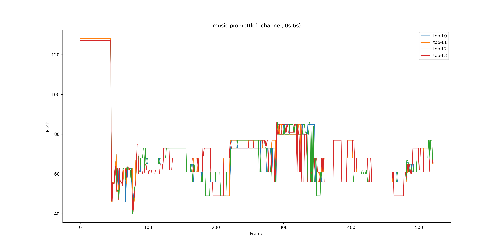
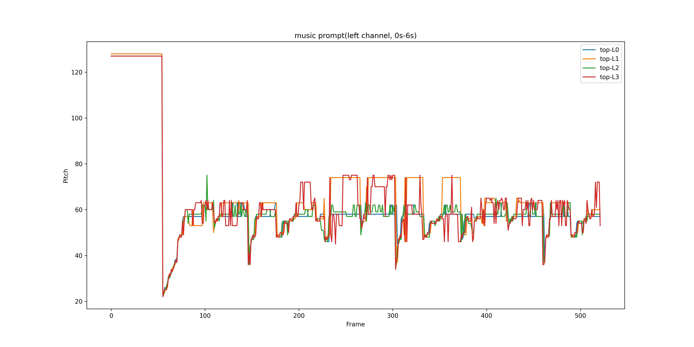
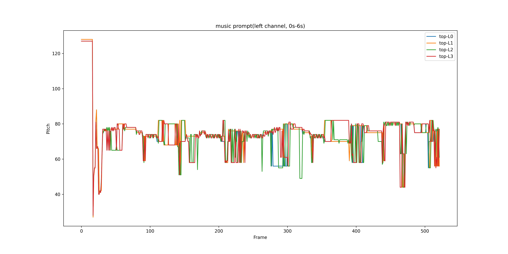
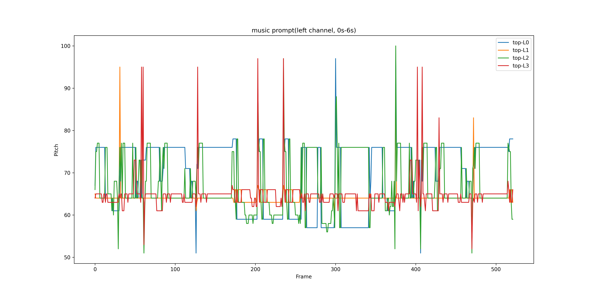
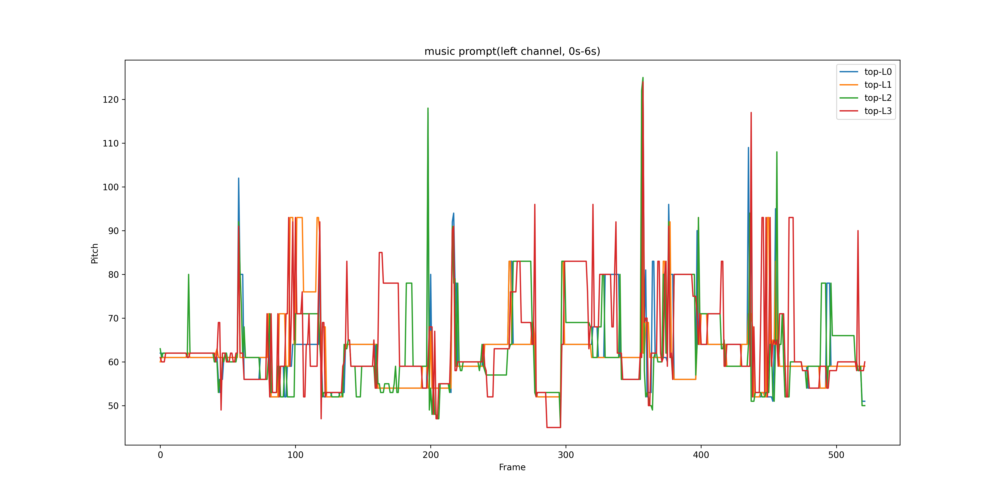
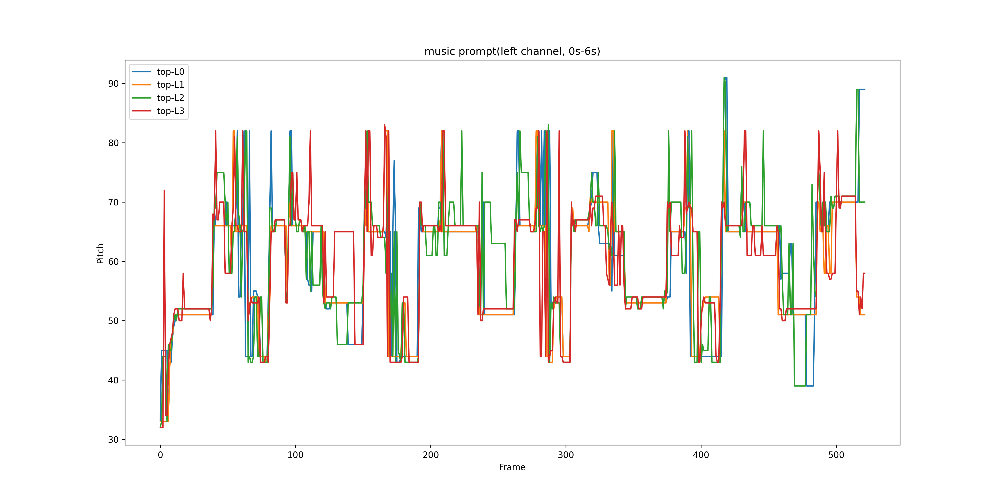

 

<h1> Editing Music with Melody and Text:   Using ControlNet for Diffusion Transformer </h1>
Siyuan Hou, Shansong Liu, Ruibin Yuan, Wei Xue, Ying Shan, Mangsuo Zhao, Chao Zhang    
Supporting webpage for ICASSP 2025.
<!-- Code is available <a href="https://github.com/NilsDem/control-transfer-diffusion/">here</a> -->

 

<h3>Abstract</h3>

Despite the significant progress in controllable music generation and editing, challenges remain in the quality and length of generated music due to the use of Mel-spectrogram representations and UNet-based model structures. To address these limitations, we propose a novel approach using a Diffusion Transformer (DiT) augmented with an additional control branch using ControlNet. This allows for long-form and variable-length music generation and editing controlled by text and melody prompts.
For more precise and fine-grained melody control, we introduce a novel top-k constant-Q Transform representation as the melody prompt, reducing ambiguity compared to previous representations (e.g., chroma), particularly for music with multiple tracks or a wide range of pitch values. To effectively balance the control signals from text and melody prompts, we adopt a curriculum learning strategy that progressively masks the melody prompt, resulting in a more stable training process.
Experiments have been performed on text-to-music generation and music-style transfer tasks using open-source instrumental recording data. The results demonstrate that by extending StableAudio, a pre-trained text-controlled DiT model, our approach enables superior melody-controlled editing while retaining good text-to-music generation performance. These results outperform a strong MusicGen baseline in terms of both text-based generation and melody preservation for editing.

# Music Editing

The examples of music editing task are all from the [Song Describer dataset](https://github.com/mulab-mir/song-describer-dataset)<a href="#note1" id="note1ref">[1]</a>. For our model, we use a text prompt and a music prompt as the conditions for music editing. The text prompt comes from the dataset, while the music prompt is the top-4 constant-Q transform (CQT) representation extracted from the target audio. The table below shows the music prompt, displaying the top-4 CQT representation of the left channel from 0 to 6 seconds. For the baseline model [MusicGEN](https://github.com/facebookresearch/audiocraft/blob/main/docs/MUSICGEN.md)<a href="#note2" id="note2ref">[2]</a>, the same text prompt and Chroma-based melody representation are used as conditional inputs.

Scroll to see all the results if necessary.

<table class="table table-sm text-center" style="vertical-align: middle;">
  <colgroup>
      <col style="width: 300px;">
      <col style="width: 400px;">
      <col style="width: 200px;">
      <col style="width: 200px;">
      <col style="width: 200px;">
  </colgroup>
  <thead>
    <tr>
      <th style="text-align:center;">text prompt</th>
      <th style="text-align:center;">music prompt</th>
      <th style="text-align:center;">Target</th>
      <th style="text-align:center;">MusicGen-melody</th>
      <th style="text-align:center;">MusicGen-melody-large</th>
      <th style="text-align:center;">Ours</th>
    </tr>
  </thead>
  <tbody>
    <tr>
      <td>A twisty nice melody song by a slide electric guitar on top of acoustic chords later accompanied with a ukelele.</td>
      <td></td>
      <td><audio src="../audios/transfer/target/95.wav" controls style="width: 200px"></audio></td>
      <td><audio src="../audios/transfer/melody/95.wav" controls style="width: 200px"></audio></td>
      <td><audio src="../audios/transfer/melody-large/95.wav" controls style="width: 200px"></audio></td>
      <td><audio src="../audios/transfer/our/95.wav" controls style="width: 200px"></audio></td>
    </tr>
    <tr>
      <td>8-bit melody brings one back to the arcade saloons while keeping the desire to dance.</td>
      <td></td>
      <td><audio src="../audios/transfer/target/99.wav" controls style="width: 200px"></audio></td>
      <td><audio src="../audios/transfer/melody/99.wav" controls style="width: 200px"></audio></td>
      <td><audio src="../audios/transfer/melody-large/99.wav" controls style="width: 200px"></audio></td>
      <td><audio src="../audios/transfer/our/99.wav" controls style="width: 200px"></audio></td>
    </tr>
    <tr>
      <td>Instrumental piano piece with a slightly classical touch and a nostalgic, bittersweet or blue mood.</td>
      <td></td>
      <td><audio src="../audios/transfer/target/327.wav" controls style="width: 200px"></audio></td>
      <td><audio src="../audios/transfer/melody/327.wav" controls style="width: 200px"></audio></td>
      <td><audio src="../audios/transfer/melody-large/327.wav" controls style="width: 200px"></audio></td>
      <td><audio src="../audios/transfer/our/327.wav" controls style="width: 200px"></audio></td>
    </tr>
    <tr>
      <td>Positive instrumental pop song with a strong rhythm and brass section.</td>
      <td></td>
      <td><audio src="../audios/transfer/target/343.wav" controls style="width: 200px"></audio></td>
      <td><audio src="../audios/transfer/melody/343.wav" controls style="width: 200px"></audio></td>
      <td><audio src="../audios/transfer/melody-large/343.wav" controls style="width: 200px"></audio></td>
      <td><audio src="../audios/transfer/our/343.wav" controls style="width: 200px"></audio></td>
    </tr>
    <tr>
      <td>A blues piano track that would be very well suited in a 90s sitcom. The piano occupies the whole track that has a prominent bass line as well, with a general jolly and happy feeling throughout the song.</td>
      <td></td>
      <td><audio src="../audios/transfer/target/567.wav" controls style="width: 200px"></audio></td>
      <td><audio src="../audios/transfer/melody/567.wav" controls style="width: 200px"></audio></td>
      <td><audio src="../audios/transfer/melody-large/567.wav" controls style="width: 200px"></audio></td>
      <td><audio src="../audios/transfer/our/567.wav" controls style="width: 200px"></audio></td>
    </tr>
    <tr>
      <td>An upbeat pop instrumental track starting with synthesized piano sound, later with guitar added in, and then a saxophone-like melody line.</td>
      <td></td>
      <td><audio src="../audios/transfer/target/835.wav" controls style="width: 200px"></audio></td>
      <td><audio src="../audios/transfer/melody/835.wav" controls style="width: 200px"></audio></td>
      <td><audio src="../audios/transfer/melody-large/835.wav" controls style="width: 200px"></audio></td>
      <td><audio src="../audios/transfer/our/835.wav" controls style="width: 200px"></audio></td>
    </tr>
    <tr>
      <td>Pop song with a classical chord progression in which all instruments join progressively, building up a richer and richer music.</td>
      <td></td>
      <td><audio src="../audios/transfer/target/903.wav" controls style="width: 200px"></audio></td>
      <td><audio src="../audios/transfer/melody/903.wav" controls style="width: 200px"></audio></td>
      <td><audio src="../audios/transfer/melody-large/903.wav" controls style="width: 200px"></audio></td>
      <td><audio src="../audios/transfer/our/903.wav" controls style="width: 200px"></audio></td>
    </tr>
    <tr>
      <td>An instrumental world fusion track with prominent reggae elements.</td>
      <td></td>
      <td><audio src="../audios/transfer/target/959.wav" controls style="width: 200px"></audio></td>
      <td><audio src="../audios/transfer/melody/959.wav" controls style="width: 200px"></audio></td>
      <td><audio src="../audios/transfer/melody-large/959.wav" controls style="width: 200px"></audio></td>
      <td><audio src="../audios/transfer/our/959.wav" controls style="width: 200px"></audio></td>
    </tr>
  </tbody>
</table> 

# Text To Music

Examples in text-to-music generation on the [Song Describer dataset](https://github.com/mulab-mir/song-describer-dataset).
Examples in timbre transfer on the [Slakh dataset](http://www.slakh.com/). We compare our method with two baselines, Music Style Transfer <a href="#note2" id="note1ref">[2]</a> and SS-VAE <a href="#note1" id="note3ref">[3]</a>.

The examples for the text-to-music task also come from the [Song Describer dataset](https://github.com/mulab-mir/song-describer-dataset)<a href="#note1" id="note1ref">[1]</a>. For both our model and the baseline model [MusicGEN](https://github.com/facebookresearch/audiocraft/blob/main/docs/MUSICGEN.md)<a href="#note2" id="note2ref">[2]</a>, only the text prompt from the dataset is used as the control condition for music generation. In this case, the music prompt for our model is left empty.

|    | Source | Target | SS-VAE | Music Style Transfer | Ours no adv. | Ours |
| :-:| :-: | :-:  |:-:  | :-: | :-: | :-: |
| Piano to guitar |<audio src="audios/slakh/true/piano_guitar_1.wav" controls style="width:  200px"></audio> | <audio src="audios/slakh/target/piano_guitar_1.wav" controls style="width:  200px"></audio> | <audio src="audios/slakh/ssvae/piano_guitar_1.wav" controls style="width:  200px"></audio> | <audio src="audios/slakh/mst/piano_guitar_1.wav" controls style="width:  200px"></audio> | <audio src="audios/slakh/ours_bottleneck/piano_guitar_1.wav" controls style="width:  200px"></audio> | <audio src="audios/slakh/ours/piano_guitar_1.wav" controls style="width:  200px"></audio> |
| guitar to voice |<audio src="audios/slakh/true/guitar_voice.wav" controls style="width:  200px"></audio> | <audio src="audios/slakh/target/guitar_voice.wav" controls style="width:  200px"></audio> | <audio src="audios/slakh/ssvae/guitar_voice.wav" controls style="width:  200px"></audio> | <audio src="audios/slakh/mst/guitar_voice.wav" controls style="width:  200px"></audio> | <audio src="audios/slakh/ours_bottleneck/guitar_voice.wav" controls style="width:  200px"></audio> | <audio src="audios/slakh/ours/guitar_voice.wav" controls style="width:  200px"></audio> |
| synth to strings |<audio src="audios/slakh/true/synth_strings.wav" controls style="width:  200px"></audio> | <audio src="audios/slakh/target/synth_strings.wav" controls style="width:  200px"></audio> | <audio src="audios/slakh/ssvae/synth_strings.wav" controls style="width:  200px"></audio> | <audio src="audios/slakh/mst/synth_strings.wav" controls style="width:  200px"></audio> | <audio src="audios/slakh/ours_bottleneck/synth_strings.wav" controls style="width:  200px"></audio> | <audio src="audios/slakh/ours/synth_strings.wav" controls style="width:  200px"></audio> |
| guitar to flute |<audio src="audios/slakh/true/guitar_flute_2.wav" controls style="width:  200px"></audio> | <audio src="audios/slakh/target/guitar_flute_2.wav" controls style="width:  200px"></audio> | <audio src="audios/slakh/ssvae/guitar_flute_2.wav" controls style="width:  200px"></audio> | <audio src="audios/slakh/mst/guitar_flute_2.wav" controls style="width:  200px"></audio> | <audio src="audios/slakh/ours_bottleneck/guitar_flute_2.wav" controls style="width:  200px"></audio> | <audio src="audios/slakh/ours/guitar_flute_2.wav" controls style="width:  200px"></audio> |
| bass to keys |<audio src="audios/slakh/true/bass_keys.wav" controls style="width:  200px"></audio> | <audio src="audios/slakh/target/bass_keys.wav" controls style="width:  200px"></audio> | <audio src="audios/slakh/ssvae/bass_keys.wav" controls style="width:  200px"></audio> | <audio src="audios/slakh/mst/bass_keys.wav" controls style="width:  200px"></audio> | <audio src="audios/slakh/ours_bottleneck/bass_keys.wav" controls style="width:  200px"></audio> | <audio src="audios/slakh/ours/bass_keys.wav" controls style="width:  200px"></audio> |
| guitar to guitar |<audio src="audios/slakh/true/guitar_disto.wav" controls style="width:  200px"></audio> | <audio src="audios/slakh/target/guitar_disto.wav" controls style="width:  200px"></audio> | <audio src="audios/slakh/ssvae/guitar_disto.wav" controls style="width:  200px"></audio> | <audio src="audios/slakh/mst/guitar_disto.wav" controls style="width:  200px"></audio> | <audio src="audios/slakh/ours_bottleneck/guitar_disto.wav" controls style="width:  200px"></audio> | <audio src="audios/slakh/ours/guitar_disto.wav" controls style="width:  200px"></audio> |

## References 

<a id="note1" href="#note1ref">[1]</a> J. Copet, F. Kreuk, I. Gat, T. Remez, D. Kant, G. Synnaeve, Y. Adi, and A. Defossez, “Simple and controllable music generation,” in Proc. NeurIPS, New Orleans, 2023.

<a id="note2" href="#note2ref">[2]</a> I. Manco, B. Weck, S. Doh, M. Won, Y. Zhang, D. Bogdanov, Y. Wu, K. Chen, P. Tovstogan, E. Benetos, E. Quinton, G. Fazekas, and J. Nam, “The Song Describer dataset: A corpus of audio captions for music-and-language evaluation,” in Proc. NeurIPS, New Orleans, 2023.
